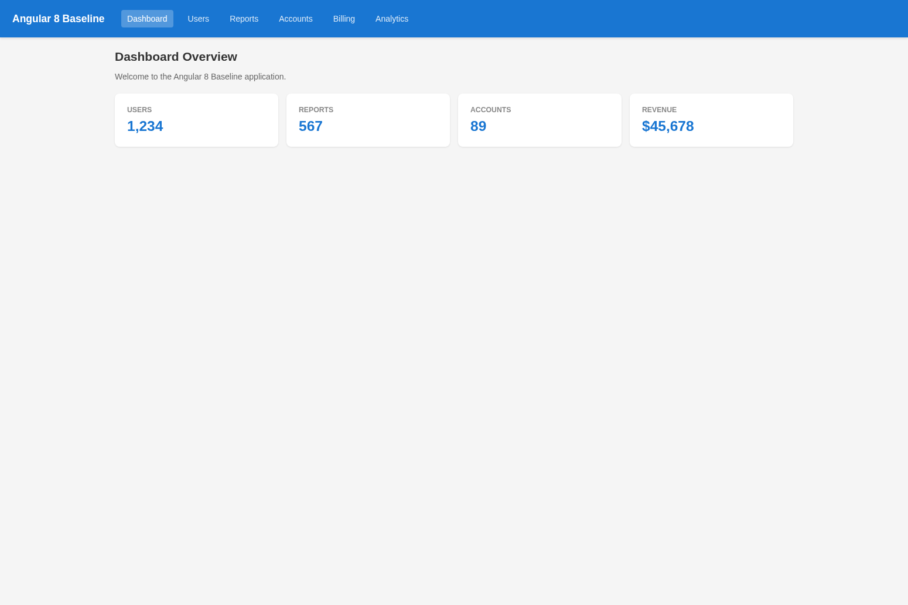
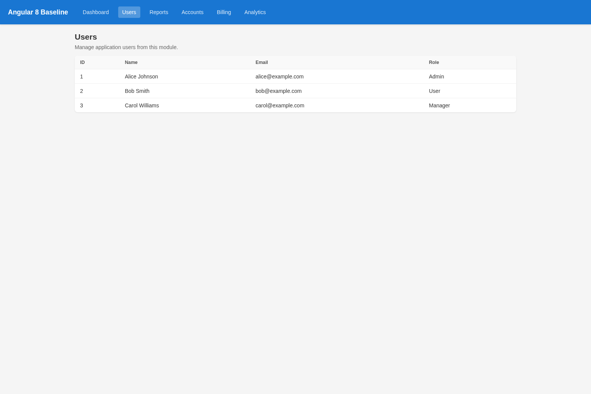

# Angular 8 Baseline Application

## Environment

```
Node.js:     v12.22.12
npm:         6.14.16
Angular CLI: 8.3.29
TypeScript:  3.5.3
```

## App Structure

```
apps/angular8-baseline/
├── src/
│   ├── app/
│   │   ├── app.module.ts              (root module)
│   │   ├── app-routing.module.ts      (lazy-loaded routes)
│   │   ├── app.component.ts           (shell with nav)
│   │   ├── features/
│   │   │   ├── dashboard/             (lazy)  – 5 components, 3 services
│   │   │   ├── users/                 (lazy)  – 5 components, 3 services
│   │   │   ├── reports/               (lazy)  – 5 components, 3 services
│   │   │   ├── accounts/              (lazy)  – 5 components, 3 services
│   │   │   ├── billing/               (lazy)  – 5 components, 3 services
│   │   │   └── analytics/             (lazy)  – 5 components, 2 services
│   │   └── shared/
│   │       └── services/              – 3 services (auth, api, notification)
│   ├── styles.scss                    (global styles)
│   └── environments/
├── angular.json
├── package.json
└── tsconfig.json
```

### Modules (6 lazy-loaded feature modules)

| Module      | Components | Services | Route       |
|-------------|-----------|----------|-------------|
| Dashboard   | 5         | 3        | /dashboard  |
| Users       | 5         | 3        | /users      |
| Reports     | 5         | 3        | /reports    |
| Accounts    | 5         | 3        | /accounts   |
| Billing     | 5         | 3        | /billing    |
| Analytics   | 5         | 2        | /analytics  |
| **Shared**  | 0         | 3        | –           |
| **Total**   | **30**    | **20**   |             |

### Routing
- Default route (`/`) redirects to `/dashboard`
- All feature modules are lazy-loaded via `loadChildren` string syntax (Angular 8 style)
- Wildcard route (`**`) redirects to `/dashboard`

### Pinned Dependencies
- **Runtime:** rxjs@6.5.5, zone.js@0.10.3, tslib@1.10.0
- **Dev:** typescript@3.5.3, tslint@5.18.0, @angular/cli@8.3.29

## Build Artifacts

Production build (`ng build --prod`) output:

| File | Size |
|------|------|
| main-es2015.js | 252 KB |
| main-es5.js | 304 KB |
| polyfills-es2015.js | 37 KB |
| polyfills-es5.js | 130 KB |
| runtime-es2015.js | 2.4 KB |
| runtime-es5.js | 2.4 KB |
| styles.css | 360 B |
| Lazy chunks (6 × 2) | ~3-7 KB each |
| **Total dist** | **~860 KB** |

## Screenshots

### Dashboard (`/dashboard`)


### Users (`/users`)


## Tests
- 3 unit tests in `app.component.spec.ts` (app creation, title, render)
- 2 unit tests in `dashboard.service.spec.ts` (service creation, getStats)
- 2 unit tests in `api.service.spec.ts` (service creation, GET request)
